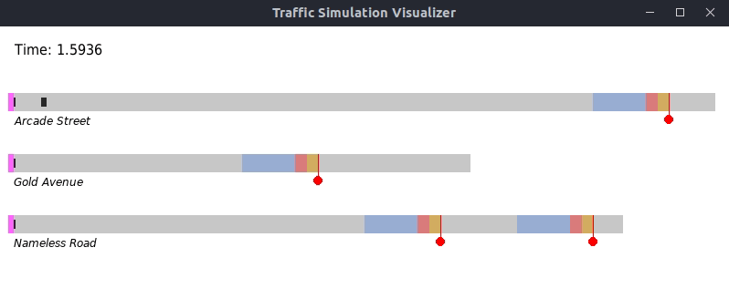

# PSE Traffic Simulation Visualizer

Script to easily visualize traffic simulations (made for the PSE course)
via plain text data output.



## Requirements

This script requires Python 3 and Pygame.

Tested with:

- Python 3.8.10
- Pygame 2.1.2
- Ubuntu 20.04

You can install Pygame using `pip3 install pygame` or similar.

## Usage

The script reads its data from stdin before launching the visualization. The
text [data format](#data-format) is described below.

You can use the following
command to pipe the output of your simulation to the visualizer (assuming
`./trafficsimulation` runs the simulation and writes its output to stdout):

```sh
./trafficsimulation | python3 visualize.py
```

Use `--help` to get an overview of all available options:

```
usage: visualize.py [-h] [-s SPEED] [--dark]

Traffic Simulation Visualizer

optional arguments:
  -h, --help            show this help message and exit
  -s SPEED, --speed SPEED
                        set the playback rate to the given factor (>= 1)
  --dark                use dark mode
```

Additional settings can be configured in the script (initial window dimensions,
custom colors, etc.).

## Controls

- Press <kbd>space</kbd> to toggle play/pause
- When paused, press (or hold down)
  - <kbd>&#8592;</kbd> to step one frame backward
  - <kbd>&#8594;</kbd> to step one frame forward
- Hold <kbd>shift</kbd> while doing the above to step by the configured speed
- Press <kbd>r</kbd> to reset the visualization to the first frame

## Data format

The visualizer reads the data from stdin line by line, where each line should
contain the next simulation 'frame'. Here is an example of what such a frame
should look like:

```plain
{
  "time": 0.0166,
  "roads": [
    {
      "name": "Arcade Street",
      "length": 500,
      "cars": [ {"x": 20}, {"x": 0} ],
      "lights": [ {"x": 300, "green": 0, "xs": 50, "xs0", 15} ]
    },
    {
      "name": "Gold Avenue",
      "length": 400,
      "cars": [ {"x": 0} ],
      "lights": [ {"x": 200, "green": 0, "xs": 50, "xs0": 15} ]
    }
  ]
}
```

_Note that each frame should be on its own single line._
_The example is split over multiple lines for readability only._

The `"time"` is the current frame's 'timestamp'. For now, it is only shown but
has no further semantic value. The `"x"` in cars and traffic lights are their
positions. And `"green"` tells the current color of a certain traffic light:
`1` means green, `0` means red. `"xs"` is the deceleration distance and `"xs0"`
is the stopping distance before the traffic light. Both `"xs"` and `"xs0"` are
optional, but the other will be ignored if one of them is left out.

## License

Licensed under the [AGPL-3.0 License](LICENSE).
